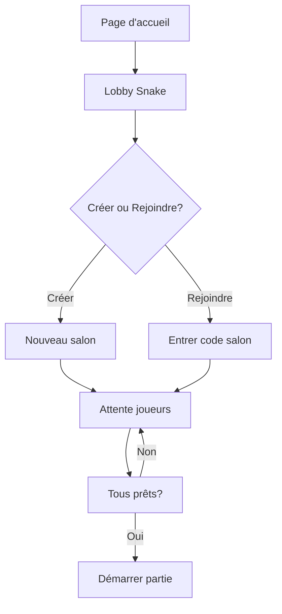
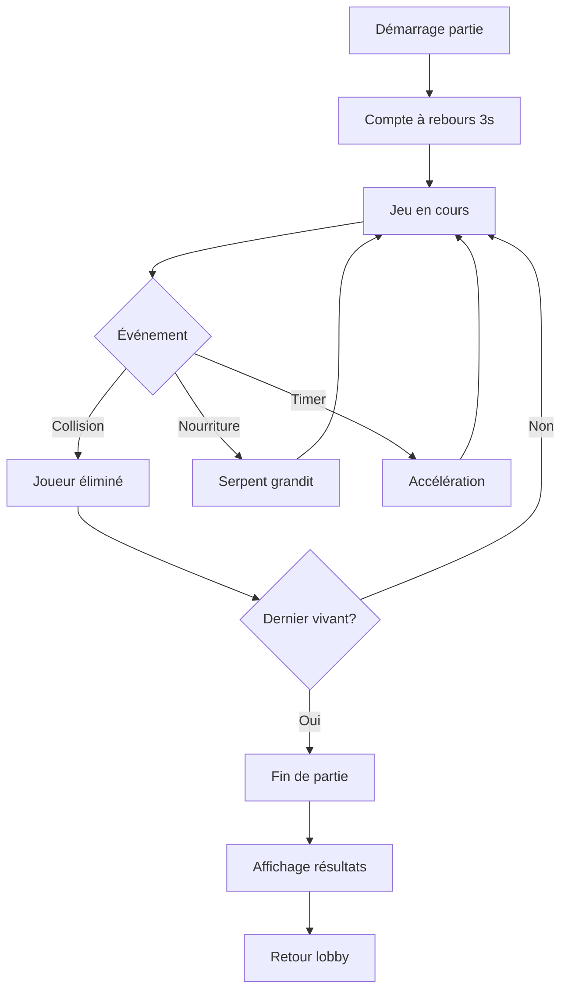

# 🐍 Plan de Développement - Snake Multijoueur

## 📋 Vue d'ensemble

Ce document décrit le plan de développement complet pour ajouter un jeu Snake multijoueur en réseau local à la plateforme de jeux "Slither Team".

### Objectifs
- Créer un jeu Snake multijoueur jouable sur le même réseau local
- Intégrer le jeu à l'interface existante (page d'accueil)
- Utiliser le serveur WebSocket existant pour la synchronisation en temps réel
- Permettre 2 à 4 joueurs simultanés

---

## 🏗️ Architecture Technique

### Structure des fichiers

```
TUSMO/
├── index.html          # Page d'accueil (à modifier)
├── server.js           # Serveur WebSocket (à modifier)
├── snake-lobby.html    # Lobby Snake (nouveau)
├── snake-lobby.js      # Logique lobby (nouveau)
├── snake-lobby.css     # Styles lobby (nouveau)
├── snake.html          # Jeu Snake (nouveau)
├── snake.js            # Logique jeu (nouveau)
└── snake.css           # Styles jeu (nouveau)
```

### Communication WebSocket

```
Client <-> Serveur WebSocket (port 8081)
         |
         ├── Messages Lobby Snake
         │   ├── create-snake-room
         │   ├── join-snake-room
         │   ├── snake-room-status
         │   ├── toggle-snake-ready
         │   └── start-snake-game
         │
         └── Messages Jeu Snake
             ├── snake-game-start
             ├── snake-direction
             ├── snake-game-state
             ├── snake-player-dead
             └── snake-game-end
```

---

## 📐 Spécifications Techniques

### 1. Configuration du jeu

| Paramètre | Valeur |
|-----------|--------|
| Taille de la grille | 40x40 cases |
| Vitesse initiale | 100ms par tick |
| Accélération | +5% toutes les 30 secondes |
| Joueurs min/max | 2-4 joueurs |
| Taille initiale snake | 3 segments |

### 2. Règles du jeu

- **Objectif** : Être le dernier serpent en vie ou avoir le plus long serpent
- **Mort** : Collision avec un mur, un autre serpent, ou soi-même
- **Nourriture** : Apparaît aléatoirement, ajoute 1 segment
- **Super nourriture** : Apparaît toutes les 30 secondes, ajoute 3 segments

### 3. Système de scores

| Condition | Points |
|-----------|--------|
| Manger nourriture normale | +10 points |
| Manger super nourriture | +50 points |
| Survivre (par seconde) | +1 point |
| Éliminer un adversaire | +100 points |
| Victoire (dernier vivant) | +200 points |

### 4. Couleurs des joueurs

| Joueur | Couleur principale | Couleur secondaire |
|--------|-------------------|-------------------|
| Joueur 1 | #00ff00 (Vert) | #00cc00 |
| Joueur 2 | #ff2e63 (Rouge) | #cc2550 |
| Joueur 3 | #00f2ff (Cyan) | #00c2cc |
| Joueur 4 | #ffd700 (Jaune) | #ccac00 |

---

## 🔄 Flow du jeu

### Phase 1 : Lobby



### Phase 2 : Jeu



---

## 💾 Structures de données

### SnakeRoom (serveur)

```javascript
class SnakeRoom {
    code: string;           // Code du salon (4 lettres)
    hostId: number;         // ID de l'hôte
    players: Map<id, SnakePlayer>;
    status: 'waiting' | 'countdown' | 'playing' | 'finished';
    gridSize: number;       // 40
    food: { x, y, isSuper };
    gameInterval: NodeJS.Timer;
    tickRate: number;       // ms entre chaque tick
    startTime: number;
}
```

### SnakePlayer (serveur)

```javascript
class SnakePlayer {
    id: number;
    username: string;
    ws: WebSocket;
    isReady: boolean;
    color: string;
    snake: Array<{ x, y }>;  // Segments du serpent
    direction: 'up' | 'down' | 'left' | 'right';
    nextDirection: string;   // Direction pour le prochain tick
    score: number;
    alive: boolean;
}
```

---

## 🎮 Contrôles

| Touche | Action |
|--------|--------|
| ↑ / W / Z | Aller vers le haut |
| ↓ / S | Aller vers le bas |
| ← / A / Q | Aller à gauche |
| → / D | Aller à droite |
| Espace | Prêt (dans le lobby) |

---

## 📡 Messages WebSocket

### Lobby

#### `create-snake-room`
```json
{ "type": "create-snake-room" }
```

#### `snake-room-created`
```json
{
    "type": "snake-room-created",
    "data": { "code": "ABCD" }
}
```

#### `join-snake-room`
```json
{
    "type": "join-snake-room",
    "data": { "code": "ABCD" }
}
```

#### `snake-room-status`
```json
{
    "type": "snake-room-status",
    "data": {
        "code": "ABCD",
        "players": [
            { "id": 1, "username": "Alice", "isReady": true, "isHost": true, "color": "#00ff00" }
        ],
        "hostId": 1,
        "status": "waiting"
    }
}
```

### Jeu

#### `snake-game-start`
```json
{
    "type": "snake-game-start",
    "data": {
        "gridSize": 40,
        "players": [
            { "id": 1, "username": "Alice", "color": "#00ff00", "startPos": { "x": 5, "y": 20 } }
        ],
        "food": { "x": 20, "y": 20, "isSuper": false }
    }
}
```

#### `snake-direction`
```json
{
    "type": "snake-direction",
    "data": { "direction": "up" }
}
```

#### `snake-game-state`
```json
{
    "type": "snake-game-state",
    "data": {
        "players": [
            {
                "id": 1,
                "snake": [{ "x": 5, "y": 20 }, { "x": 5, "y": 21 }, { "x": 5, "y": 22 }],
                "score": 30,
                "alive": true
            }
        ],
        "food": { "x": 15, "y": 10, "isSuper": false },
        "tickRate": 95
    }
}
```

#### `snake-game-end`
```json
{
    "type": "snake-game-end",
    "data": {
        "winner": { "id": 1, "username": "Alice" },
        "results": [
            { "id": 1, "username": "Alice", "score": 450, "length": 15 }
        ]
    }
}
```

---

## 📝 Étapes de développement

### Phase 1 : Fondations ✅
- [x] Créer ce plan de développement

### Phase 2 : Lobby Snake ✅
- [x] Créer `snake-lobby.html` - Structure HTML du lobby
- [x] Créer `snake-lobby.css` - Styles cohérents avec l'existant
- [x] Créer `snake-lobby.js` - Logique client WebSocket

### Phase 3 : Serveur ✅
- [x] Ajouter les classes `SnakeRoom` et `SnakePlayer` au serveur
- [x] Implémenter les handlers pour les messages Snake
- [x] Implémenter la logique du jeu côté serveur (game loop)

### Phase 4 : Jeu Snake ✅
- [x] Créer `snake.html` - Structure avec canvas
- [x] Créer `snake.css` - Styles du jeu
- [x] Créer `snake.js` - Rendu canvas et synchronisation WebSocket

### Phase 5 : Intégration ✅
- [x] Ajouter le Snake à `index.html`
- [x] Tests en réseau local

---

## 🎨 Design

Le design suit les conventions de l'application existante :
- Palette sombre avec accents colorés
- Effets glassmorphism
- Police Montserrat / Roboto Mono
- Animations fluides

### Palette de couleurs (réutilisée)

```css
--bg-primary: #0f172a;
--bg-secondary: #1e293b;
--accent-red: #ff2e63;
--accent-yellow: #ffd700;
--accent-blue: #00f2ff;
--accent-green: #00ff00;
--text-primary: #ffffff;
--text-secondary: #94a3b8;
```

---

## 🚀 Déploiement

Le jeu utilise l'infrastructure existante :
1. Serveur HTTP Python sur le port 8080
2. Serveur WebSocket Node.js sur le port 8081

Les joueurs peuvent rejoindre via :
- Local : `http://localhost:8080`
- Réseau : `http://[IP_LOCALE]:8080`

---

## 📊 Tests à effectuer

- [ ] Connexion de 2 joueurs depuis des machines différentes
- [ ] Connexion de 4 joueurs simultanés
- [ ] Synchronisation des mouvements
- [ ] Détection des collisions
- [ ] Affichage correct des scores
- [ ] Gestion des déconnexions
- [ ] Reconnexion en cours de partie

---

*Document créé le 9 décembre 2025*
*Version 1.0*
